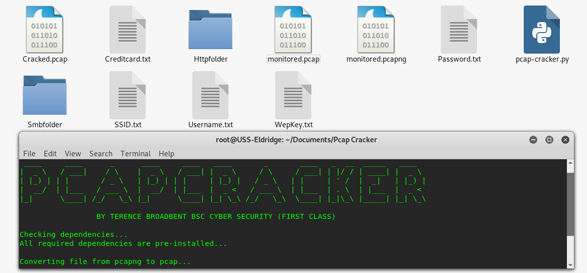

# PCAP-CRACKER

python pcap-cracker.py monitored.pcapng

Python script file to decrypt encrypted IEEE (802.11) Radio .pcap files captured via Wireshark. 
The script first extracts the Service Set IDentifier (SSID), and uses it to obtain the Wired Equivalent Privacy (WEP) key.
Once the WEP key has been extracted - it then decrypts the .pcap file completly (Cracked.pcap).

Bonus!! now includes automated username, password and object exporter.

## CONSOLE DISPLAY
 
