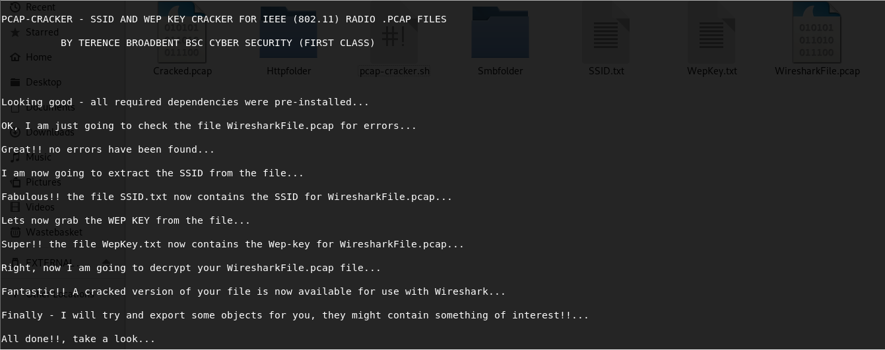
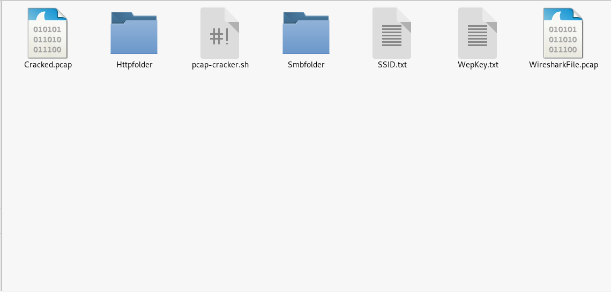

# PCAP-CRACKER
A simple bash file to decrypt encrypted IEEE (802.11) Radio .pcap files captured via Wireshark.
The bash file first extracts the SSID, and then uses it to obtain the WEP key.
Once the wep-key has been extracted - it then decrypts the .pcap file completly.

